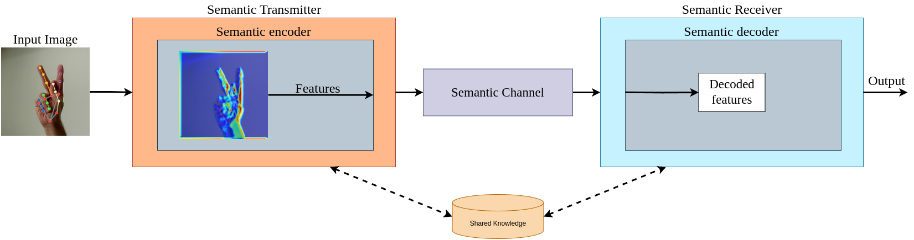

# XAI for AI-Driven Semantic Communications

This repository explores how semantic communications can be implemented across two different scenarios, utilizing Convolutional Neural Networks (CNN) and You Only Look Once (YOLO) frameworks. Semantic communications focus on transmitting the meaning or semantic content of the data rather than the full raw data. By only sending the essential information, we can reduce bandwidth usage, lower latency, and potentially improve system efficiency.

In particular, recent work on beyond 5G and emerging 6G networks has highlighted the importance of semantically enriched communication [1]. By extracting and filtering goal-specific semantic information at the source, and performing semantic decoding and post-processing at the destination, these systems aim to handle multiple time-varying, deadline-constrained traffic flows in a multi-user, distributed edge-to-cloud network. Consequently, new frameworks for semantic information extraction, novel knowledge representation models, and innovative metrics infused with semantics are required to manage congestion and measure performance while preserving relevancy. This repository aims to showcase initial steps toward realizing such a vision through practical CNN and YOLO examples.

---

## Table of Contents
- [Overview](#overview)
- [Scenario 1: ASL Semantic Transmission](#scenario-1-asl-semantic-transmission)
- [Scenario 2: V2X Semantic Transmission](#scenario-2-v2x-semantic-transmission)
- [Contact](#contact)

---

## Overview

This project contains two primary scenarios:

1. **ASL (American Sign Language) Gesture Recognition**: Images of ASL gestures are processed by a Convolutional Neural Network (CNN) to extract only the semantic meaning of the sign. Instead of sending the entire image, the system transmits a condensed representation (semantic features) which can be interpreted on the receiving end. 

2. **V2X (Vehicle-to-Everything) Object Detection**: In a connected vehicle environment, real-time camera feeds are used with YOLO to detect and classify objects (vehicles, pedestrians, traffic signs, etc.). Again, the focus is on sending the semantic information (e.g., object types and positions) rather than raw video frames, optimizing communication channels and reducing bandwidth.

---

### Scenario 1: ASL Semantic Transmission

#### Goal
To recognize specific hand gestures from the American Sign Language (dataset referenced in [2]), we develop a system that extracts semantic features and transmits them over a low-bandwidth channel. In parallel, two Explainable AI methods, **Grad-CAM** and **SHAP** are used to visualize and interpret which regions of each gesture image the CNN deems most relevant. This scenario builds on research presented in [3] and [4].

---

#### Process Flow

1. **Image Collection**  
   * A dataset of ASL gestures (e.g., letters A, B, C...) is stored in the `datasets/` folder.  
   * These images represent the raw data.

2. **CNN Model**  
   * A Convolutional Neural Network (`/models`) is used to:  
     - Preprocess the input images (resizing, normalization).  
     - Extract semantic features (learned gesture representations).  
     - Generate predictions for each gesture class.

3. **Semantic Encoder**  
   * Although the CNN outputs a label or class probability, the system can also encode higher-level semantics (e.g., a compact feature vector) to transmit through low-bandwidth channels.

4. **Transmission**  
   * Only the compact representation (semantic features) is sent over the network rather than the entire image.

5. **Semantic Decoder**  
   * On the receiving side, the decoder reconstructs or interprets the transmitted semantics—e.g., identifying the recognized letter or word.

6. **XAI Visualizations**  
   * **Grad-CAM**  
     - Generates heatmaps that highlight the most relevant regions the model uses to classify each gesture.  
     - Helps validate whether the model focuses on the correct hand regions for each gesture.

   * **SHAP Values**  
     - Explains individual predictions by showing how each feature (pixel) contributes positively or negatively to the classification.  
     - Provides contribution scores for each input feature, helping to further dissect and understand the model’s decisions.

7. **Output**  
   * The recognized gesture or class label is produced.  
   * **Grad-CAM outputs**: Heatmaps are stored in the `output/gradCam_ASL_output` folder.  
   * **SHAP outputs**: Visualizations or arrays of SHAP values can be stored in a `output/shap_ASL_output` folder.

---

#### Files (Scenario 1)

* **`datasets\gradCam_ASL_dataset`**  
  - Contains sample images of ASL gestures.  
  - You can apply the CNN model to these images to generate Grad-CAM and SHAP outputs.

* **`\models`**  
  - Stores the trained CNN model used for classification and XAI analysis.

* **`src\preprocess.py`**  
  - Preprocesses the input images (resizing, normalization).

* **`src\ASL_GradCam_export.py`**  
  - Loads images from the `datasets\gradCam_ASL_dataset` folder.  
  - Applies the CNN model from `models/`.  
  - Generates Grad-CAM visualizations for every layer of the CNN.  
  - Saves these heatmaps in the `output\gradCam_ASL_output` folder.

* **`src\load_ASL_data.py`**  
  - Loads the ASL dataset for SHAP analysis.  
  - Constructs the data matrix used to compute SHAP values.

* **`src\ASL_Shap_export.py`**  
  - Uses the CNN model to calculate SHAP values for each input image.  
  - Exports these SHAP explanations (plots or arrays) to visualize how each pixel affects the model’s classification decision.

---

## Scenario 2: V2X Semantic Transmission

### Goal
In this scenario, we leverage the dataset referenced in [5] to detect and classify objects such as pedestrians from camera feeds in a vehicular environment. We then transmit only essential semantic information, including bounding boxes and classifications, rather than full images. By integrating Explainable AI with **Grad-CAM**, we can see how the YOLO detection model prioritizes features in each frame. This approach significantly reduces bandwidth usage and enables faster transmission in real-time V2X scenarios.

### Process Flow

1. **Data Acquisition**  
   - Collect raw images (camera feeds) from car-mounted cameras, roadside units, or drones.  
   - These images are stored in the `datasets/gradCam_V2X_dataset` folder.  

2. **YOLO Detection (with XAI using GradCAM)**  
   - Use YOLO (You Only Look Once) from the `models/` folder to detect objects and classify them (e.g., as pedestrians).  
   - **Perform GradCAM analysis** based on the methodology presented in *YOLOv8_Explainer* [6], which provides insights into how YOLO focuses on different regions of the image.  
   - This ensures that the model is correctly identifying critical object features (e.g., highlighting pedestrians rather than background elements).  

3. **Semantic Extraction**  
   - For each detection, extract bounding box coordinates, object classes, and other metadata.  
   - Use the GradCAM outputs to understand which regions influenced YOLO’s decision-making process.  

4. **Transmission**  
   - **Instead of transmitting full raw images, only detected objects (bounding boxes, object classes, and metadata) are sent over V2X communication channels.**  
   - This **reduces bandwidth usage and allows for faster communication**, which is crucial in real-time applications such as collision avoidance and autonomous navigation.  

5. **Semantic Utilization**  
   - On the receiving end, an application (e.g., a collision avoidance system) fuses these semantic messages to build a dynamic representation of the environment.  
   - GradCAM heatmaps, saved in `output/gradCam_V2X_output`, can be used for validation and debugging.  

6. **XAI Benefits with GradCAM**  
   - **Transparency**: Demonstrates which image regions are most influential in YOLO’s detection process.  
   - **Debugging**: If GradCAM highlights irrelevant regions, data collection or model training can be improved.  
   - **Trust & Safety**: In critical automotive systems, being able to explain why a detection is made fosters greater confidence in the model.  

### Files (Scenario 2)

- **`datasets/gradCam_V2X_dataset/`**  
  *Contains the raw images captured from cameras.*  

- **`models/`**  
  *Holds the YOLO model used for both detection and GradCAM analysis.*  

- **`src/v2x_processing.py`**  
  *A Python script that processes the raw images, runs YOLO detection, and performs GradCAM analysis based on the YOLOv8_Explainer methodology. The results (e.g., GradCAM overlay images) are saved in `output/gradCam_V2X_output`.*  

- **`v2x_semantic_extraction.py`**  
  *Extracts and formats semantic data (e.g., bounding boxes, object classes). May also aggregate GradCAM-related metadata for further analysis or logging.*  

---

**Reference:**  
1. S. E. Trevlakis, N. Pappas and A. -A. A. Boulogeorgos, “[Towards Natively Intelligent Semantic Communications and Networking](https://ieeexplore.ieee.org/document/10454584),” in IEEE Open Journal of the Communications Society, vol. 5, pp. 1486-1503, 2024. 

2. Kouvakis, V., Mitsiou, L., Trevlakis, S. E., Boulogeorgos, A.-A. A., & Tsiftsis, T. (2025), “American Sign Language dataset for semantic communications“, IEEEDataPort & Zenodo.

3. V. Kouvakis, S. E. Trevlakis and A. -A. A. Boulogeorgos, “[Semantic Communications for Image-Based Sign Language Transmission](https://ieeexplore.ieee.org/abstract/document/10418996),” in IEEE Open Journal of the Communications Society, vol. 5, pp. 1088-1100, 2024.

4. V. Kouvakis, S. E. Trevlakis, A. -A. A. Boulogeorgos, T. Tsiftsis, K. Singh, and N. Qi, “[When Sign Language Meets Semantic Communications](https://ieeexplore.ieee.org/document/10817453/figures#figures),” 2024 IEEE International Symposium on Personal, Indoor and Mobile Radio Communications (PIMRC), Valencia, Spain, 2024.

5. Ramon Sanchez-Iborra, Rodrigo Asensio-Garriga, Gonzalo Alarcon-Hellin, Luis Bernal-Escobedo, Stylianos Trevlakis, Theodoros Tsiftsis, Antonio Skarmeta, January 20, 2025, “[Multi-perspective Traffic Video Recording](https://ieee-dataport.org/documents/multi-perspective-traffic-video-recording)“, IEEE Dataport.

6. Sarma Borah, P. P., Kashyap, D., Laskar, R. A., & Sarmah, A. J. (2024). *[A Comprehensive Study on Explainable AI Using YOLO and Post-Hoc Method on Medical Diagnosis.](https://iopscience.iop.org/article/10.1088/1742-6596/2919/1/012045/pdf)* *Journal of Physics: Conference Series, 2919*(1), 012045.

---

## Contact
- **Stylianos E. Trevlakis**: (trevlakis@innocube.org)
- **Vasileios Kouvakis**: (kouvakis@innocube.org)